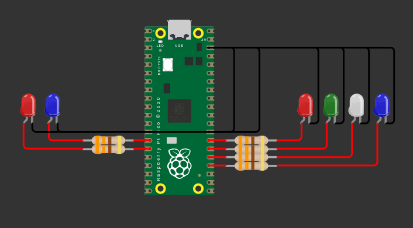

# bin-unicorn

Embedded application that interfaces with the [Reading Borough Council API](https://api.reading.gov.uk/) to fetch information about the next scheduled bin collection and display it.

Targets the Raspberry Pi Pico W (RP2040) and runs on bare metal.

It lights up LEDs corresponding to the next bin collection, as well as status LEDs.

## Hardware

I used 5mm LEDs and wired them up to the GPIO pins with a 330 Ohm resistor in-between.

### GPIO pins

The following Pico GPIO pins are used by the software:

| Pin  | LED              | Colour  | Purpose                  |
|------|------------------|---------|--------------------------|
| GP10 | Diffused blue    | Blue    | WiFi connected indicator |
| GP11 | Diffused red     | Red     | Error indicator          |
| GP18 | Blue             | Blue    | Food waste bin           |
| GP19 | White            | White   | Domestic (general) waste |
| GP20 | Green            | Green   | Garden waste             |
| GP21 | Red              | Red     | Recycling bin            |

The colour is solely dependent on the LEDs you use and you can choose any colours you like.

### Example setup

Here is how I wired it up on my breadboard - you can of course use more than one ground pin if need be.



An editable version of this diagram can be found at: https://wokwi.com/projects/461313005327349761

## Development setup

The recommended workflow is to use Visual Studio Code with the Raspberry Pi Pico extension, which will handle installing the right version of the SDK and GCC ARM embedded toolchain.

If using a different setup or the command line, you need to install the SDK and toolchain manually, then set `$PICO_SDK_PATH` to the SDK path, and add the embedded toolchain's `bin/` folder to your `$PATH`.

Per-user build values (WiFi credentials, project-specific secrets like `BIN_UNICORN_HOME_ADDRESS`) are sourced from environment variables.

### Configuring per-user build values in VS Code

Open **Preferences: Open User Settings (JSON)** from the command palette and add:

```json
"cmake.configureEnvironment": {
    "BIN_UNICORN_WIFI_SSID": "Your Network",
    "BIN_UNICORN_WIFI_PASSWORD": "Your Password",
    "BIN_UNICORN_HOME_ADDRESS": "40 Caversham Road Reading, RG17EB"
}
```

Notes:
- This goes in **user** settings, not the committed `.vscode/settings.json`.
- After editing user settings, pick the `Debug` preset in the CMake Tools status bar and reconfigure.

## Building

Builds are done with CMake. On the command line you can run:

```sh
cmake --preset default
cmake --build --preset debug
```

This will produce an `.elf` file at `build/Debug/bin_unicorn.elf` and a `.uf2` file at `build/bin_unicorn.uf2`.

You can build in VS Code by using the CMake Tools extension - select your build preset using the interface on the left, and then use the CMake: Build command to build (default shortcut: F7).

## Deploying to Pico

In VS Code the Pico extension allows you to directly flash and debug onto a Pico connected via the debug probe using the menu options on the left: `Debug Project` and `Flash Project (SWD)`.

If you don't have a debug probe, you can hook the Pico up directly to your PC and press the BOOTSEL button for a while until it shows up as a USB device on your system. Then either use the `Run Project (USB)` option from the extension or manually copy `build/bin_unicorn.uf2` to the storage device.

It is advisable if you are deploying a finalised build to use a release build:

```sh
cmake --build --preset release
```

This will make the code much faster - for example, HTTP requests take 5 seconds instead of 30 seconds!